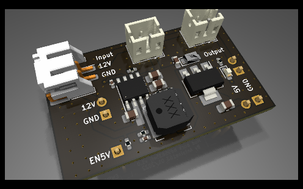
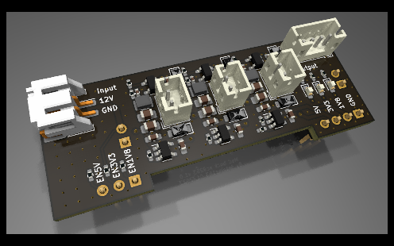
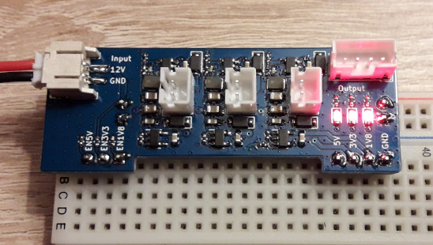

# PowerMod
Module d’alimentation compatible avec les breadboard  
**Note**: Des valeurs de composants restent à finaliser...

## mod_boost_ap3012
Entrée (J1, J2): 5V  
Sortie boost (J3, J4): 24V

## mod_buck_bd95835efj
Entrée (J1, J2, J6): 12V / 1.5A  
Sortie buck (J4): 5.6V / 2A  
Sortie ldo (J7, J5): 5V / 1.2A  

**Attention:** Le courant max sur l'ensemble des sortie est de 3A.

## mod_buck_xc9263
Entrée (J1, J2, J7): 12V  
Sortie 1 buck (J4): 5.35V  
Sortie 1 ldo (J5, J6): 5V / 200mA  
Sortie 2 buck (J8): 3.5V  
Sortie 2 ldo (J5, J6): 3.3V / 250mA  
Sortie 3 buck (J9): 2.1V  
Sortie 3 ldo (J5, J6): 1.8V / 200mA  

 
